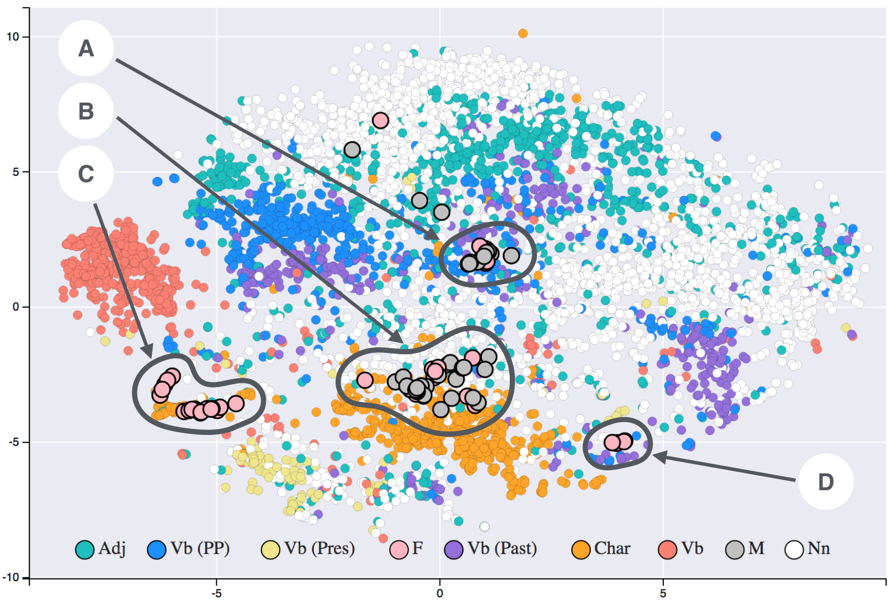
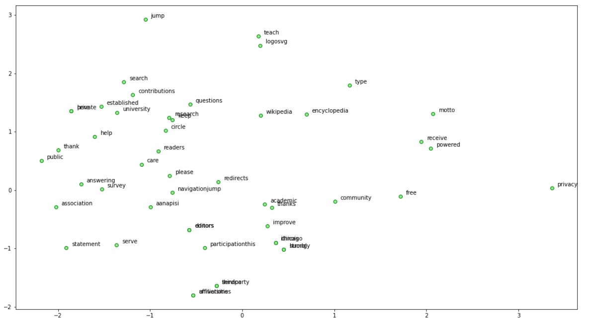

# Word-Embedding-using-Glove

### WORD EMBEDDING
Performed word embeddings using Glove on the wikipedia document of 'UIC' and created a scatter plot to see the clusters of the projections.

### What is Word Embedding?

Word embeddings are a type of word representation that allows words with similar meaning to have a similar representation.

They are a distributed representation for text that is perhaps one of the key breakthroughs for the impressive performance of deep learning methods on challenging natural language processing problems.

### RESULTS

